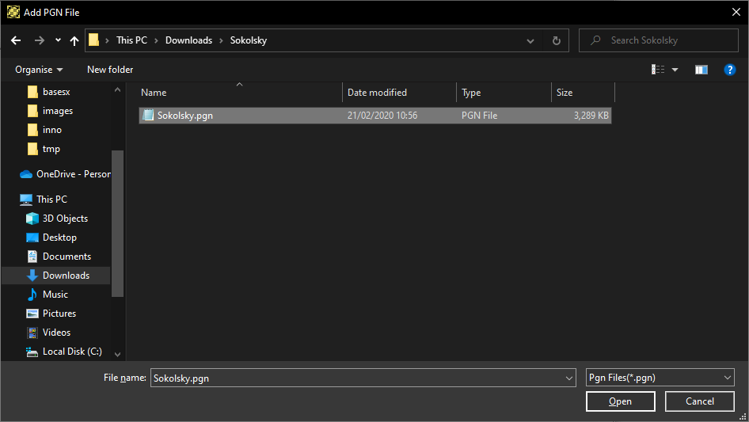
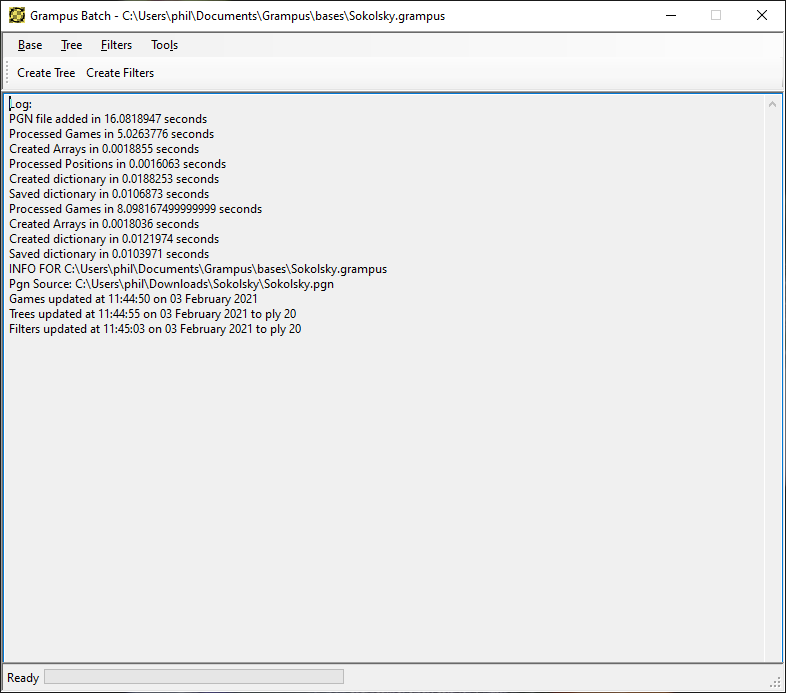
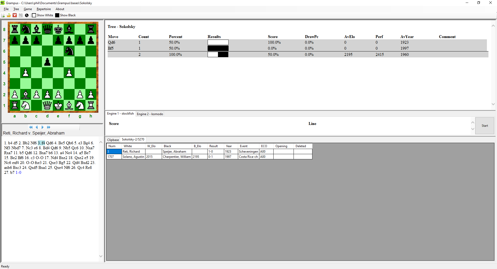
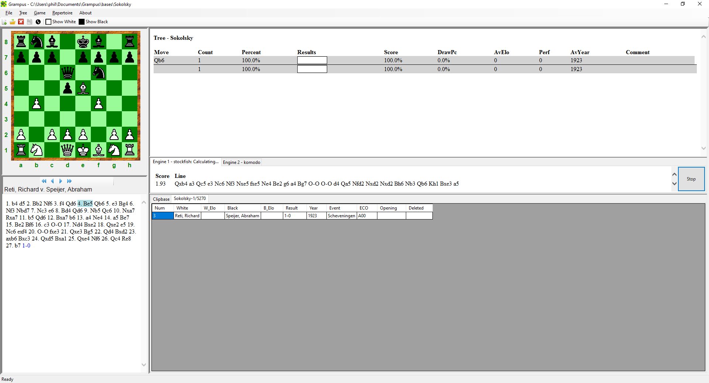
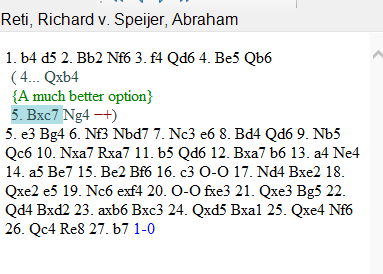

# Getting Started

This article shows you how to get started using Grampus.

## Installation

Download **setup.exe** for the latest release from [Releases](https://github.com/pbbwfc/Grampus/releases).

After runnning the setup, it will install the code in *C:\Program Files\Grampus*, install sample bases to *Documents\Grampus\bases* and create two Desktop Shortcuts.

The two applications are **Grampus Batch** used for long running processes on bases and **Grampus** for working with the games withing a base.

## Create a new base

Open **Grampus Batch** using the shortcut. Then use *Base -> New* and create a new base called **Sokolsky**.

This will create a files in *Documents\Grampus\bases*: **Sokolsky.grampus**

## Import a PGN

We will now import a PGN file with games for the Sokolsky opening.

We can use this link to download a file:

[https://www.pgnmentor.com/openings/Sokolsky.zip](https://www.pgnmentor.com/openings/Sokolsky.zip)

Once downloaded, unzip to extract the pgn file.

Now use *Tools -> Add PGN file* and select the downloaded file.

Now create a tree using *Tree -> Create*. Accept the default settings.

Now create filters using *Filters -> Create*. Accept the default settings.

Finally confirm the details stored using *Base -> Info*.

This should be shown in the Log:

Now close **Grampus Batch**.

## Load Game

Now open **Grampus**.

Load the Sokolsky base by using *File -> Open*.

Load the Sokolsky tree by using *Tree -> Open*.

Now load the 4th Game by double clicking or using the right click menu.

You can now review the moves and the tree updates to show alternative moves in the database and limits the list to those games that contain the position.

Thus, if you select move **3. f4** only 2 games are shown.

## Using the Engine

We can now use the engine to analyse the game. If we go to move **4. Be5** and then press the **Start** button, we can see that Stockfish much prefers **4...Qxb4** to give Black a large advantage. 

If we examine this further we can see that Stockfish has found the variation **4...Qxb4 5. Bxc7 Ng4**. This threatens **Qd4** winning, as it attacks the Rook and if you protect it there is mate on **f2**.

We can add this as a variation by playing the moves on the board. Stockfish find no good move, as, for example, **6. e3** can be answered by **6...Nxe3**.

## Adding Variations, Comments and Assessments

After adding the variation **4...Qxb4 5. Bxc7 Ng4**, right click the move **Qxb4** and use *Add Comment After*. Now enter *"A much better option"*.

Now right click the move **Ng4** and use *Add NAG*. Now chose *-+*, a decisive advantage for Black.

Now save the Game by using the *Save* button or menu *Game->Save*.

## Adding ECO Classifiers

We can now add an ECO classification to all the games in the database.

Use the menu *Tools->Set ECOs*. This will add ECO classifiers to every game. In this case, they are nearly all variants of **A00**.

Now exit the application by using menu *File->Exit*.