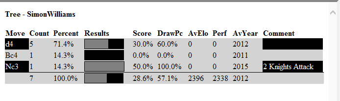
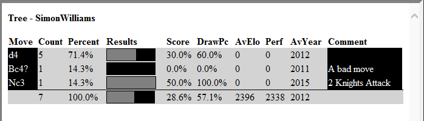
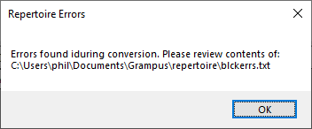

# Using the Repertoire Feature

ScincNet includes a feature to help creating and using opening repertoires.

This allows you to create two repertoires, one as White and one as Black.

## How are they stored?

The repertoires are stored in the folder **Documents\ScincNet\repertoire**. They consist of three elements:

- Scid bases holding the moves called **WhiteRep** and **BlackRep**.
- The repertoire tree in JSON format in the files **whte.json** and **blck.json**.
- Text files holding a list of issues found in the repertoires, if any, called **whteerrs.txt** and **blckerrs.txt**.

Two small repertoires are provided in the installation.

## The Repertoire menu

THe repertoires can be displayed in the tree panel. To show them, you use the **Show White** and **Show Black** options. These options are also available as buttons on the toolbar.

To create the repertoire you just add games and moves to the relevant base and then update the repertoire using the **Update White** and **Update Black** options. 
If the update has issues, these will be added to the relevant errors file, so that you can review them and revise the games in the database.

## Displaying the Repertoire

To display the repertoire first open a database of games. This will populate the tree. If you now select **Show Black**, the moves from the repertoire will be displayed in black cells.
Any move assessments and comments will also be shown. For example:



If you select **Show White**, the moves from the repertoire will be displayed in white cells.

## Editing the repertoire

You can edit the reportoire by opening the releavnt base and then edit or add games. For, example we might want to add a response to the **Bc4** move shown in the tree above.

We can open the base and then add the **Bc4** move and a suitable response and comments. If we then press **Update Black**, we will see an updated tree:



## Using the errors file

The repertoire is intended to give your **single** preferred choice for any position. Thus the Black repertoire with more than one move for Balck in any position will be treated as an error.

To investigate this I used the default repertoire and added **1...e5** in addition to the default single choice of **1...c6**.

I then ran **Update Black**. An error was notified by this dialog:



If you then examine the contents of this file, it contains one line:

```
Duplicate move found for fen rnbqkbnr/pppppppp/8/8/4P3/8/PPPP1PPP/RNBQKBNR b KQkq e3 0 1 with moves e5 and c6.
```
